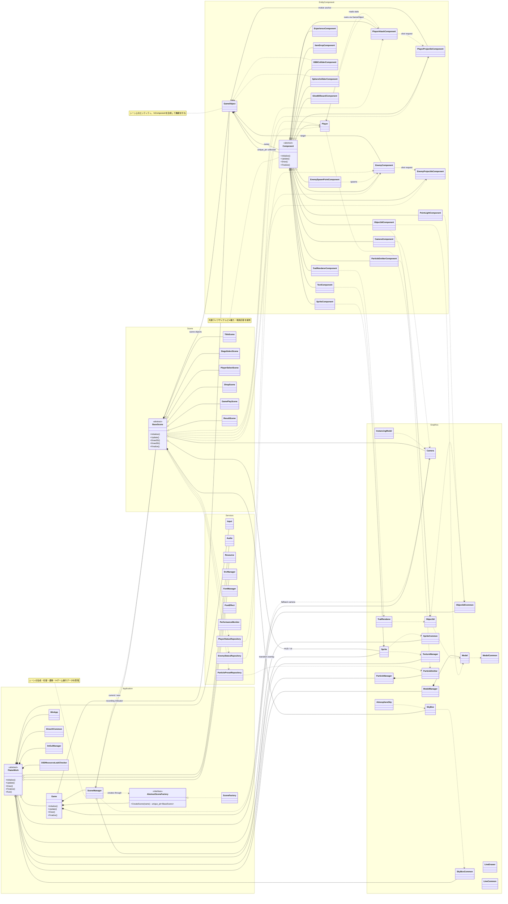

# CG2_DirectX クラス全体関係図

`project/externals` 配下の外部ライブラリは対象外とし、プロジェクト固有の主要クラスを、継承・所有・参照・実装依存の観点で整理した図です。

## 凡例

- `継承`：白抜き三角矢印（`<|--`）
- `実装`：点線の白抜き三角矢印（`<|..`）
- `所有／合成`：黒ひし形（`*--`）。所有側の寿命に従う
- `集約`：白ひし形（`o--`）。非所有参照または共有サービス
- `依存／参照`：点線矢印（`..>`）

特に中心となる構造は、`Game → SceneManager → BaseScene → GameObject → Component` です。各シーンは `BaseScene` を継承し、個々のゲームオブジェクトへ `Player`、敵、攻撃、描画、コライダーなどのコンポーネントを組み合わせます。
